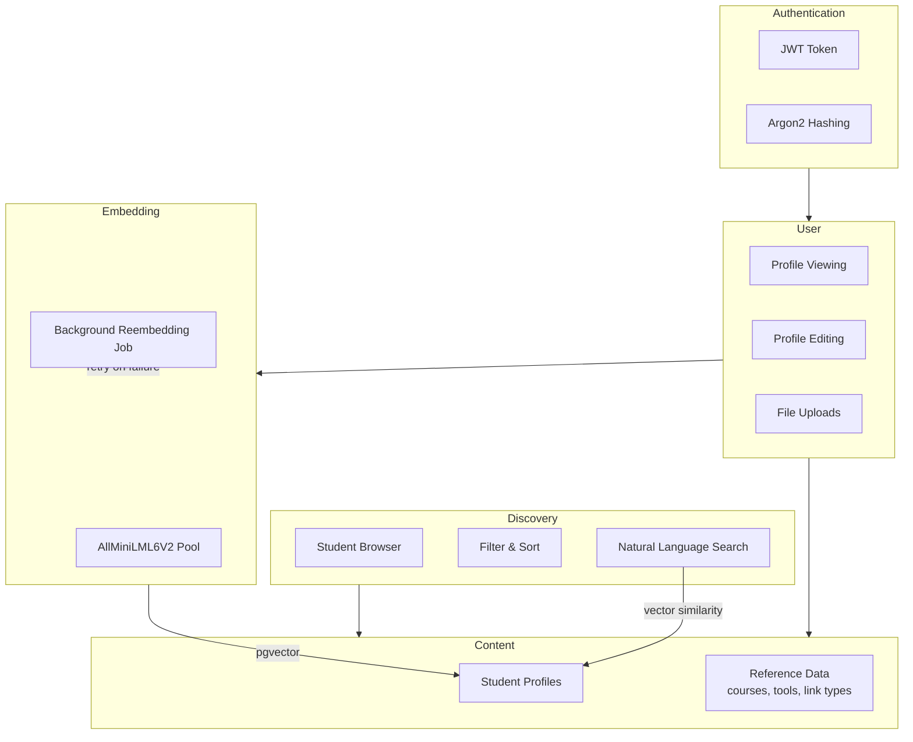
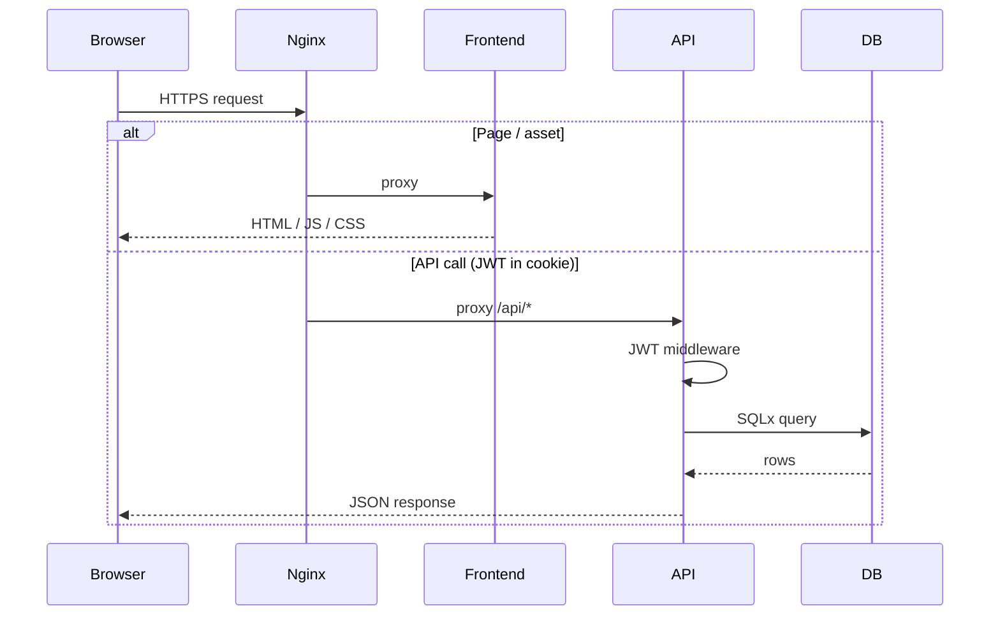
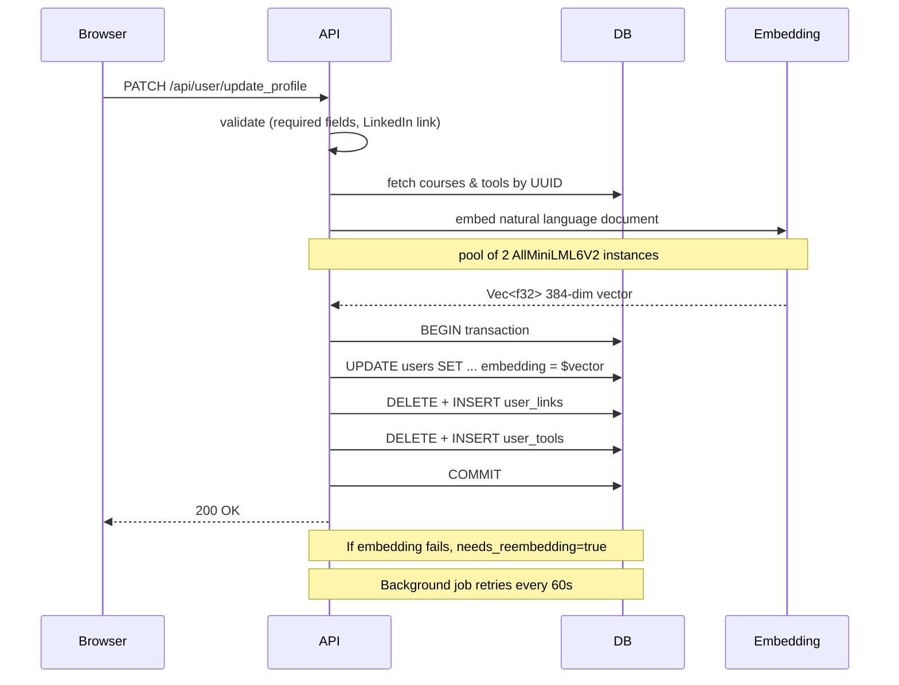
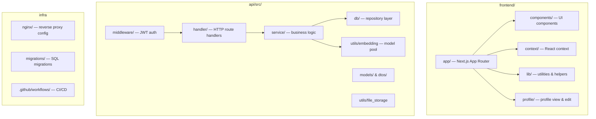
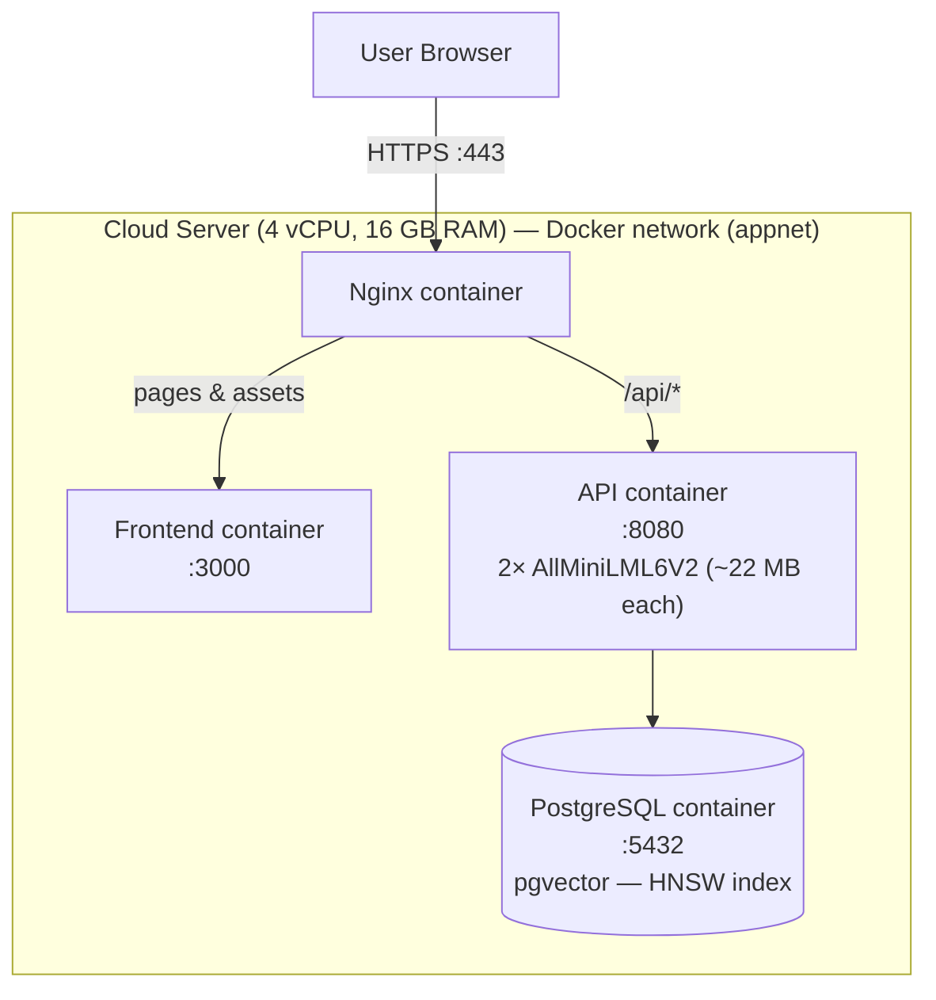
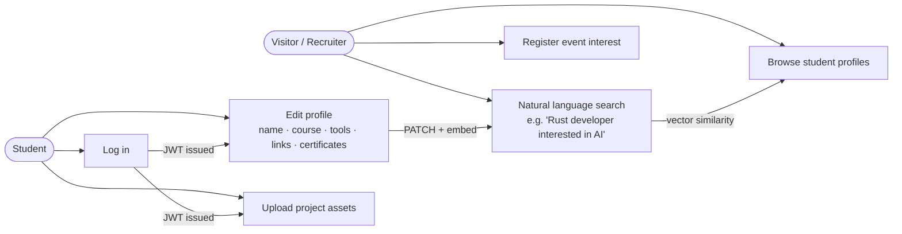

# C&E Futures '26

### Student Showcase — University of Huddersfield

---

A web platform for the University of Huddersfield's School of Computing & Engineering annual showcase event, connecting final-year students with industry professionals and recruiters.

## About

C&E Futures '26 is an event held on **19 June 2026** at the University of Huddersfield, where final-year Computing & Engineering students present their projects to industry partners and potential employers.

The platform serves as both a pre-event information hub and a discovery tool — allowing visitors to browse student profiles and register their interest in attending before the event takes place.

## What's on offer

- **Live project demos** — see working software and hardware built by final-year students
- **Poster presentations** — deep-dives into research and technical work
- **Networking opportunities** — meet students, academics, and fellow industry guests

The event runs from **12:00 PM to 5:00 PM** and covers the university's areas of expertise including Engineering, AI, Cyber Security, and Creative Computing.

## Features

- Browse and search student profiles using natural language
- Filter and discover students across technologies and disciplines
- Student profile editing — name, course, tools, links, certificates
- Register interest in attending the event
- User account registration and login

## Who is it for?

- **Industry professionals & recruiters** looking to spot emerging talent and hire graduates
- **Commercial partners** interested in R&D collaboration with the university
- **Anyone** curious about what the next generation of Computing & Engineering graduates is building

---

## Technical

### Tech Stack

| Layer | Technology |
|---|---|
| **Frontend** | Next.js 16, React 19, TypeScript, Tailwind CSS 4 |
| **Backend** | Rust, Actix-web 4 |
| **Database** | PostgreSQL 18 + pgvector |
| **Auth** | JWT, Argon2 |
| **AI / Search** | FastEmbed, AllMiniLML6V2 (384-dim vectors), pgvector HNSW index |
| **Infrastructure** | Docker, Nginx, GitHub Actions |

### Software Architecture

The project follows a **frontend/backend split monorepo** structure with three main services orchestrated via Docker Compose. The architecture is documented using the **4+1 model**:

---

#### Logical View
The system's functional decomposition into major subsystems.

---

#### Process View
Runtime communication between services for key flows.

---

#### Development View
How the codebase is organised across modules and packages.

---

#### Physical View
How the services are deployed on the production host.

---

#### Scenarios (+1)
Key use cases that exercise the four views above.

---

*Built by [Mateusz Kroplewski](https://github.com/Kroplewski-M)*

